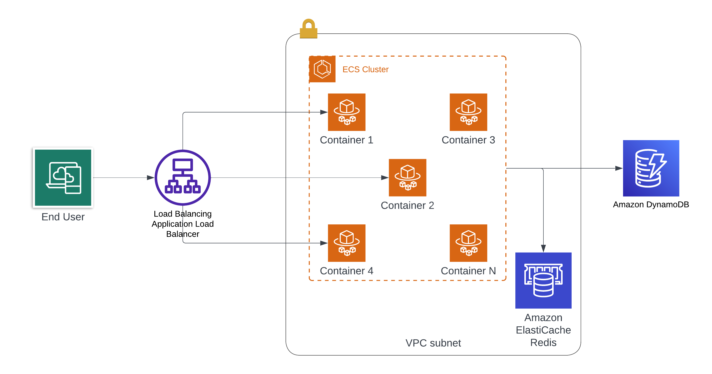

# Shortly

## Local Docker Compose Deploy

```bash
git clone https://github.com/luiscib3r/shortly.git
cd app
docker compose up
```

## AWS Deploy

## Set CDK context

```bash
git clone https://github.com/luiscib3r/shortly.git
cp cdk.context.example.json cdk.context.json
```

Edit `cdk.context.json` and set your values:

Example

```json
{
  "ShortlyStack:hostedZoneName": "yourdomain.com",
  "ShortlyStack:domainName": "link.yourdomain.com"
}
```
then

```bash
cdk deploy
```

### CDK commands

 * `cdk deploy`      deploy this stack to your default AWS account/region
 * `cdk diff`        compare deployed stack with current state
 * `cdk synth`       emits the synthesized CloudFormation template

## Infrastructure Architecture

